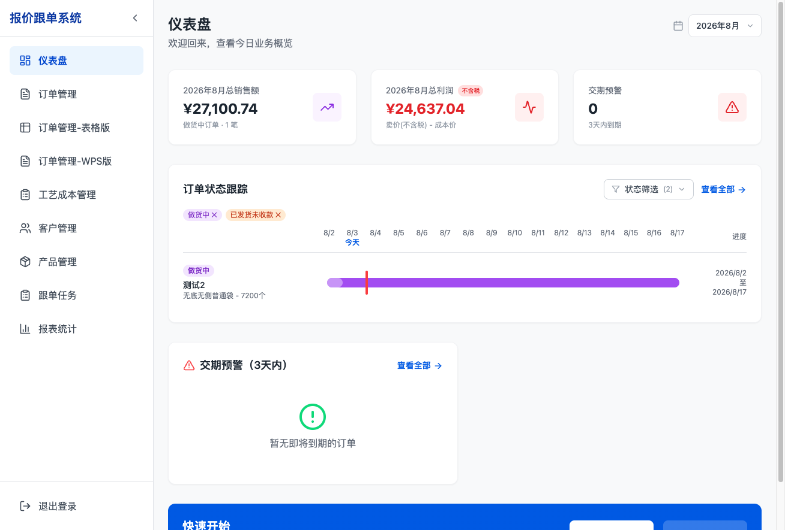
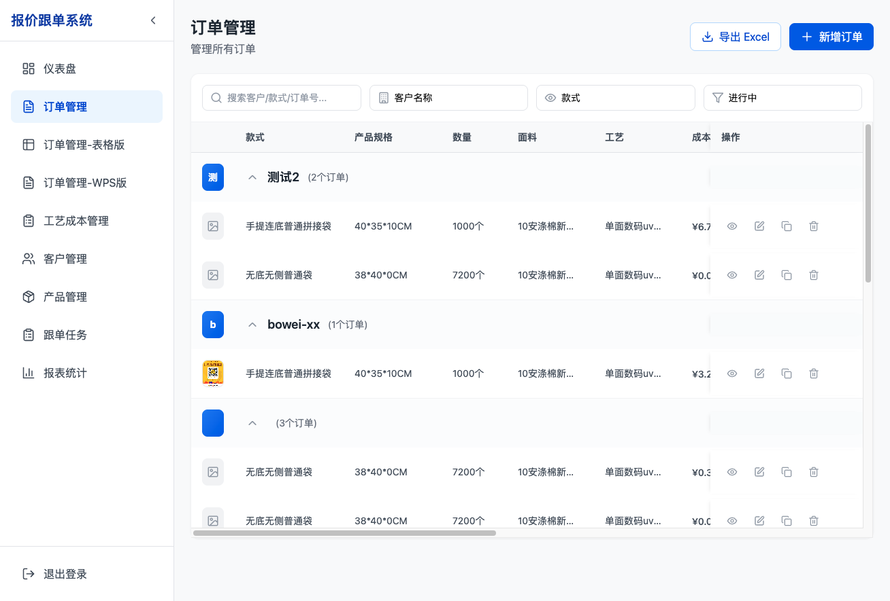
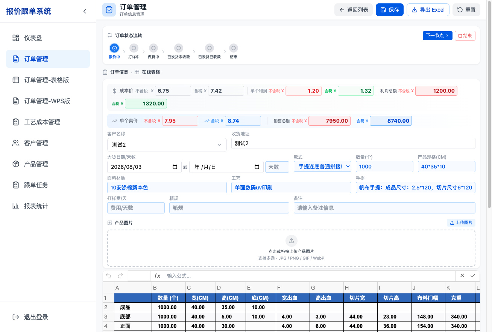
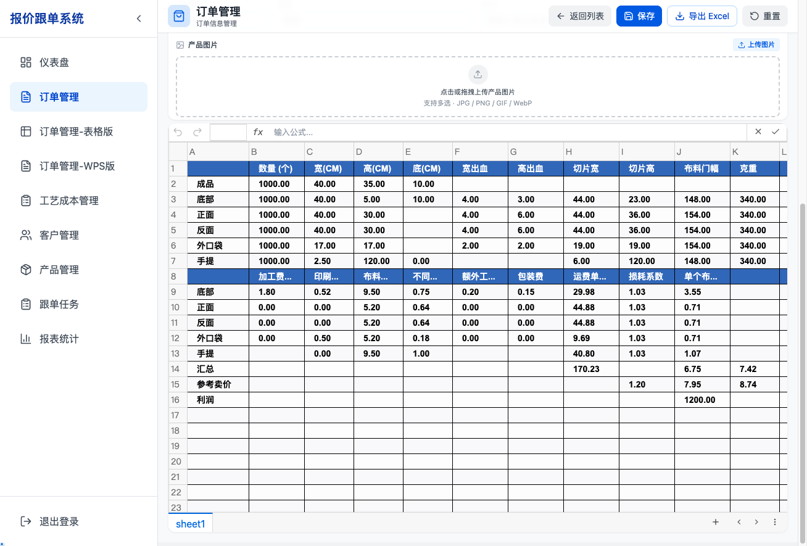
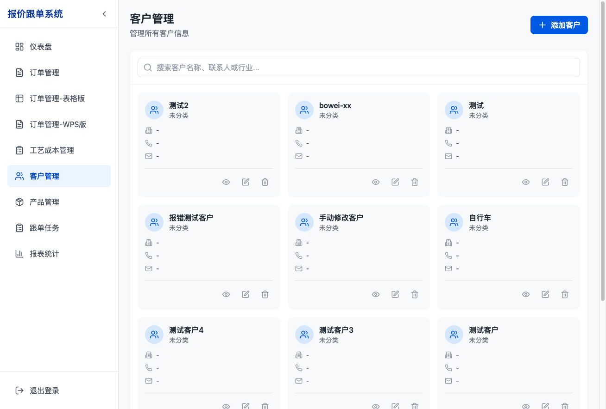
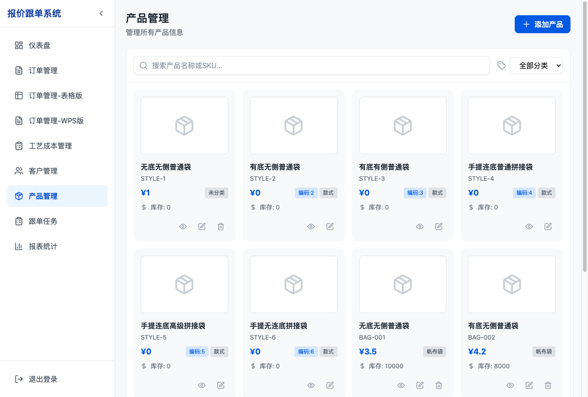
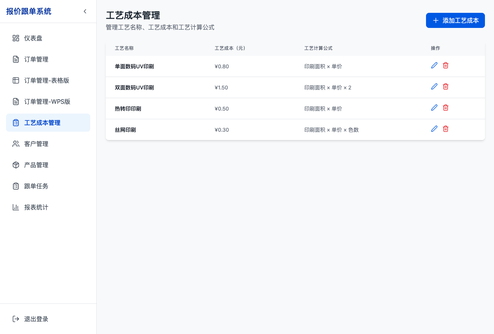

# 帆布袋报价跟单系统 — 用户操作手册

> 版本：v1.2.x
> 日期：2026-09-10
> 适用用户：业务员、跟单员、管理员

---

## 目录

1. [产品定位](#1-产品定位)
2. [快速开始](#2-快速开始)
3. [功能模块总览](#3-功能模块总览)
4. [工作台](#4-工作台)
5. [订单管理（核心模块）](#5-订单管理核心模块)
6. [做货跟踪](#6-做货跟踪)
7. [年度业务报表](#7-年度业务报表)
8. [订单对账管理](#8-订单对账管理)
9. [在线表格与价格计算](#9-在线表格与价格计算)
10. [客户管理](#10-客户管理)
11. [产品管理](#11-产品管理)
12. [工艺成本管理](#12-工艺成本管理)
13. [用户、角色与权限管理](#13-用户角色与权限管理)
14. [Excel 导出](#14-excel-导出)
15. [数据关联全景图](#15-数据关联全景图)
16. [产品规划](#16-产品规划)

---

## 1. 产品定位

### 1.1 这是什么系统

**帆布袋报价跟单系统**是一款面向帆布袋生产加工企业的 B 端一体化管理工具，核心解决三个业务痛点：

| 痛点 | 解决方案 |
|------|----------|
| **报价慢、算错价** | 内置 6 种款式试算模板，在线表格公式自动计算成本/卖价/利润，秒级出报价 |
| **跟单乱、漏节点** | 6 节点状态流转 + 时间戳自动记录，每笔订单从报价到结束全程可追溯 |
| **利润算不清** | 成本价、含税价、不含税/含税卖价、利润额自动联动，仪表盘按月统计 |

### 1.2 核心价值

- 📊 **精准报价**：在线表格引擎驱动，修改任一参数 → 成本/卖价/利润实时重算
- 🔄 **全流程跟单**：报价中 → 打样中 → 做货中 → 已发货未收款 → 已发货已收款 → 结束
- 💰 **利润透视**：含税/不含税双口径利润计算，仪表盘按月度筛选查看总利润
- 📁 **基础数据复用**：客户、产品、工艺一次录入，订单中自动联动引用
- 📥 **Excel 导出**：订单列表批量导出 + 单订单含表格公式导出，与线下工作流无缝衔接
- 📱 **全链路跟踪（规划中）**：微信群状态同步及时提醒 + 小程序移动端实时查看，报价跟单全程闭环

### 1.3 适用角色

| 角色 | 主要使用场景 |
|------|-------------|
| 业务员 | 新建报价 → 在线表格试算 → 生成订单 → 导出报价单 |
| 跟单员 | 查看仪表盘交期预警 → 推进订单状态 → 全程跟踪订单进度 |
| 管理员 | 查看月度销售额/利润 → 导出订单报表 → 管理客户/产品基础数据 |

---

## 2. 快速开始

### 2.1 登录

1. 打开系统，进入登录页
2. 输入**邮箱**/密码登录，系统跳转至工作台
3. 登录状态通过加密 token 持久化存储，刷新页面不会丢失登录态；token 过期时自动续期，无需重新登录

> 💡 系统采用双 token 机制（访问凭证 15 分钟 + 刷新凭证 7 天），长时间无操作将自动退出并提示。

### 2.2 界面布局

```
┌──────────────────────────────────────────────────────────┐
│  侧边栏（可折叠）        │         主内容区                │
│  📊 工作台              │                                  │
│  🏭 做货跟踪            │                                  │
│  📋 订单管理            │   当前页面内容                   │
│  📋 订单管理-表格版     │                                  │
│  📋 订单管理-WPS版      │                                  │
│  🧾 订单对账管理        │                                  │
│  📈 年度业务报表        │                                  │
│  🛠 工艺成本管理        │                                  │
│  📄 模板管理            │                                  │
│  👥 客户管理            │                                  │
│  📦 产品管理            │                                  │
│  🔐 用户/角色管理       │（仅管理员可见）                  │
├───────────────────────┤                                  │
│  🚪 退出登录            │                                  │
└──────────────────────────────────────────────────────────┘
```

- 点击侧边栏顶部按钮可**折叠/展开**侧边栏，折叠后仅显示图标
- 当前所在页面的菜单项高亮显示
- 菜单按权限动态显示：无对应查看权限的模块自动隐藏

---

## 3. 功能模块总览

| 模块 | 路径 | 核心功能 |
|------|------|----------|
| 工作台 | `/` | 当月/全年销售与利润统计、订单状态跟踪甘特图、今日新增与每日待办、收款/打样提醒 |
| 做货跟踪 | `/production-tracking` | 做货流程甘特图总览、任务条拖拽排期、多条件筛选、步骤增删改 |
| 订单管理 | `/quotes` | 订单列表（搜索/多选筛选/分组）、新建/编辑/删除、批量导出 |
| 订单编辑 | `/quotes/new` `/quotes/:id` | 在线表格报价、价格联动计算、状态流转、图片上传 |
| 订单对账管理 | `/reconciliation-alerts` | 已收货已收款订单的成本核对与对账（状态 5→8） |
| 年度业务报表 | `/annual-report` | 业绩卡片、月度趋势图、订单明细、客户情况分析（表格/折线图双形态） |
| 客户管理 | `/customers` | 客户信息 CRUD、客户详情（关联订单） |
| 产品管理 | `/products` | 产品/款式管理（6 种默认款式不可删除，自定义产品可绑定模板） |
| 模板管理 | `/sheet-templates` | 款式试算模板一对多管理 |
| 工艺成本 | `/process-costs` | 工艺名称、成本、计算公式管理 |
| 用户/角色管理 | `/users` `/roles` | RBAC 权限体系：用户账号、角色、权限目录 |

---

## 4. 工作台



> 原"仪表盘"已于 v1.2.x 更名为"工作台"。

### 4.1 月度销售与利润统计

工作台顶部展示**当月/全年核心经营指标**，支持按月份筛选和利润口径切换：

| 指标 | 计算口径 |
|------|----------|
| 当月总销售额 | Σ（数量 × 含税卖价），统计做货中(3)/已发货未收款(4)/已发货已收款(5)且做货开始时间在所选月份的订单 |
| 当月总利润（不含税） | Σ（数量 ×（不含税卖价 − 成本价）），同口径 |
| 当月总利润（含税） | Σ（数量 ×（含税卖价 − 含税价）），同口径 |
| 当月订单总数 | 做货中(3)/已发货未收款(4)/已发货已收款(5)/打样中(2)订单总和 |
| 全年销售额/利润 | 同口径，统计做货开始时间在当年的订单 |

**操作方式：**
- **月份筛选**：点击月份下拉框，可从所有有做货记录的月份中选择查看（默认当前月）
- **利润口径切换**：点击利润指标标签，在"不含税"和"含税"之间切换，数值和颜色实时变化
- **状态记忆**：月份和利润口径选择通过 localStorage 持久化，刷新或重新登录后保持

> ⚠️ **统计口径说明**：已对账(8)、结束(6)的订单不计入销售统计。

### 4.2 订单状态跟踪（甘特图）

工作台展示按状态筛选的**活跃订单甘特图**（自原仪表盘迁移并保留全部功能）：

- **多选筛选器**：可同时勾选多个订单状态进行筛选（筛选标签与日期对齐排列）
- **默认选中**：打样中、做货中、已发货未收款（3 个状态）
- **快捷操作**：支持"重置默认"和"全选"按钮
- **状态记忆**：筛选结果通过 localStorage 持久化
- **甘特图**：按做货日期区间展示时间轴，直观显示各订单进度，点击订单可查看详情

### 4.3 今日新增与每日待办

- **今日新增**：展示当天新建的订单列表，点击可跳转订单编辑页
- **每日待办**：个人待办事项卡片，支持添加/勾选完成/编辑/删除，数据按用户存储在浏览器本地
- 待办卡片无多余边框，采用柔和背景色设计，视觉更简洁

### 4.4 收款与打样提醒

- **收款提醒**：已发货未收款超过设定天数的订单提醒卡片
- **打样完成提醒**：打样完成超过设定天数未进入做货的订单提醒
- 点击提醒卡片可跳转到对应订单处理

---

## 5. 订单管理（核心模块）

### 5.1 订单列表

路径：`/quotes`



**列表功能：**

| 功能 | 操作说明 |
|------|----------|
| 搜索 | 顶部搜索框，按客户名称或订单号模糊匹配 |
| 状态筛选 | 下拉选择：全部活跃订单 / 指定状态 / 已结束 |
| 客户筛选 | 多选下拉（支持搜索），可同时筛选多个客户 |
| 款式筛选 | 下拉选择特定款式（一级显示款式名称，二级显示模板名称，选中后输入框仅显示款式名称） |
| 做货日期筛选 | 按做货开始/结束日期区间筛选 |
| 客户分组 | 订单按客户名称分组，可展开/折叠（每组默认 5 条，组内分页） |
| 查看/编辑 | 点击订单行进入编辑页 |
| 复制 | 复制订单信息创建新订单（自动生成全新订单号） |
| 删除 | 二次确认后删除（有关联数据时展示关联详情） |
| 导出 Excel | 点击"导出 Excel"按钮，选择导出全部或选中订单 |
| 底部汇总 | 实时显示当前筛选结果的销售总额(含税)与利润合计 |

**排序规则**（订单列表固定排序）：

1. 订单状态（按流程阶段分组：报价中 → 打样中 → 打样完成 → 做货中 → …）
2. 修改时间（最新修改在前）
3. 客户名称（字母序）
4. 订单号（倒序）

**订单号列**：列表第一个数据列（产品图之后、款式之前）展示 16 位数字订单号。

### 5.2 新建/编辑订单

路径：`/quotes/new`（新建） `/quotes/:id`（编辑）



页面自上而下分为以下区域：

#### ① 顶部悬浮工具栏

| 按钮 | 功能 |
|------|------|
| 返回列表 | 回到订单列表页 |
| 保存 | 保存订单信息（首次保存自动生成订单号） |
| 导出 Excel | 导出当前订单 + 在线表格（含公式）到 Excel 文件 |
| 重置 | 恢复订单信息为默认值（谨慎操作） |

#### ② 订单状态流转

8 节点进度条，可视化展示当前状态：

```
报价中 → 打样中 → 打样完成 → 做货中 → 已发货未收款 → 已发货已收款 → 已对账
 (1)      (2)        (7)       (3)         (4)            (5)          (8)
```

**状态流转规则：**

| 操作 | 规则 | 时间记录 |
|------|------|----------|
| 下一节点 | 1→2→7→3→4→5 顺序前进 | 进入节点时自动记录对应时间 |
| 退回上一节点 | 2→1, 7→2, 3→7, 4→3, 5→4, 6→5 | 仅退回状态，不修改时间 |
| 直接结束 | 仅"报价中/打样中/打样完成"可用 | 记录 endTime |
| 确认对账 | 仅"已发货已收款(5)"可进入"已对账(8)"，在订单对账管理页操作 | 记录 reconciledTime |
| 退回对账 | 已对账(8)→已发货已收款(5)，在订单对账管理页操作 | 清除对账状态 |

**各状态对应的时间节点：**

| 状态 | 时间字段 | 说明 |
|------|----------|------|
| 报价中 (1) | quoteTime | 创建订单时自动记录 |
| 打样中 (2) | sampleTime | 进入打样中时记录 |
| 打样完成 (7) | sampleCompletedTime | 进入打样完成时记录 |
| 做货中 (3) | productionStartTime | 进入做货中时记录 |
| 已发货未收款 (4) | shippingTime | 进入已发货未收款时记录 |
| 已发货已收款 (5) | paymentTime | 进入已发货已收款时记录 |
| 已对账 (8) | reconciledTime | 在订单对账管理确认时记录 |
| 结束 (6) | endTime | 进入结束时记录 |

> ⚠️ **"已发货已收款(5)"与"已对账(8)"不允许直接调整为"结束"**——状态 5 需先经订单对账管理进入状态 8，状态 8 为终态。
> 💡 状态必须通过按钮操作流转，不能直接设置。时间节点在进入/退回时自动同步。

#### ③ 做货流程（仅"做货中"状态显示）

6 步骤勾选清单：面料采购 → 裁剪 → 印刷 → 缝纫 → 质检 → 包装

#### ④ 订单信息卡片

| 字段 | 填写说明 | 联动规则 |
|------|----------|----------|
| 客户名称 | 输入或下拉选择已有客户 | 新客户在保存时自动创建客户档案 |
| 收货地址 | 文本输入 | 选择已有客户时自动填充 |
| 款式 | 下拉选择 1-6 | 切换款式时在线表格自动切换对应模板 |
| 面料材质 | 默认"10安涤棉新本色" | — |
| 工艺 | 默认"单面数码uv印刷" | — |
| 手提材质 | 默认"帆布手提" | — |
| 数量 | 数字输入 | 联动在线表格成品行数量 |
| 产品规格 | 格式 `宽*高*底` | 从在线表格成品行自动同步 |
| 手提规格 | 文本 | 从在线表格手提行自动同步 |
| 箱规 | 文本输入 | — |
| 打样费/天 | 费用和天数分开填写 | — |
| 大货天数 | 数字输入 | 自动计算做货结束日期 = 开始日期 + 大货天数 |
| 做货开始日期 | 日期选择 | — |
| 做货结束日期 | 自动计算 | = 开始日期 + 大货天数 |
| 备注 | 多行文本 | — |
| 产品图片 | 拖拽或点击上传 | 支持多选、预览、删除 |

#### ⑤ 价格信息区

展示在订单信息卡片和在线表格之间，包含以下联动计算：

| 字段 | 来源/公式 | 说明 |
|------|-----------|------|
| 成本价（不含税） | 从在线表格"汇总"行 × "参考卖价"列读取 | 可手动覆盖 |
| 含税价 | 成本价 × 1.1（自动计算） | 可手动覆盖 |
| 单个卖价（不含税） | 从在线表格"参考卖价"行读取 | — |
| 单个卖价（含税） | 从在线表格"参考卖价"行读取 | — |
| 单个利润（不含税） | 单个卖价（不含税）− 成本价 | 红色显示 |
| 单个利润（含税） | 单个卖价（含税）− 含税价 | 绿色显示 |
| 利润总额（不含税） | 单个利润（不含税）× 数量 | 红色显示 |
| 利润总额（含税） | 单个利润（含税）× 数量 | 绿色显示 |
| 销售总额（不含税） | 单个卖价（不含税）× 数量 | — |
| 销售总额（含税） | 单个卖价（含税）× 数量 | — |

> 💡 所有金额字段统一保留 2 位小数。总额计算以保留 2 位小数的基础价格为基准，避免浮点精度偏差。

### 5.3 订单号生成规则

格式：**16 位随机数字**（全局唯一，创建时自动校验防重复）

- **创建后不变**：订单号不再随客户名称/款式变化而重建
- **复制订单**：复制时必须生成全新订单号（不复用原订单号）
- **展示位置**：订单列表第一个数据列（产品图之后）；订单编辑页只读展示在客户名称之前；导出 Excel 与导出收款单第一列均为订单号

---

## 6. 做货跟踪

路径：`/production-tracking`（侧边栏"做货跟踪"菜单）

以甘特图总览全部订单的做货流程，支持拖拽调整排期。与订单编辑页的"做货流程"功能数据互通（同一套任务数据，支持新增步骤和修改步骤详细内容）。

### 6.1 顶部筛选栏

| 筛选项 | 说明 |
|--------|------|
| 客户 | 多选下拉，精确匹配客户名称 |
| 订单号 | 输入框，模糊匹配 |
| 订单状态 | 多选下拉（做货中/已发货未收款等） |
| 日期区间 | 起止日期选择，筛选与区间有交集的任务 |

- 筛选条件通过 localStorage 持久化（`production_tracking_filters`），刷新后保持

### 6.2 做货流程甘特图

- **任务条**：每个订单的每个做货步骤对应一个任务条，标签格式为 `[缩略图]-[客户名6字]-[步骤名8字]-[数量]`（超长自动截断）
- **拖拽排期**：左右拖动任务条整体平移日期，拖拽边缘拉伸调整起止日期；修改后自动同步到服务器（防抖 600ms）
- **同步徽标**：任务条右上角实时显示同步状态——saving（同步中）/ dirty（待同步）/ error（同步失败，可重试）/ saved（已保存）
- **今日标记**：时间轴上高亮今日日期竖线
- **排序**：订单按最早任务日期 + 订单号双重排序；无日期订单排最后；订单内步骤按序号升序

### 6.3 步骤编辑

与订单编辑页做货流程一致的操作能力：

- **新增步骤**：在指定订单下添加新做货步骤（名称、计划/实际起止日期、材料清单、备注）
- **修改步骤**：编辑步骤详细内容（双击任务条或编辑面板）
- **删除步骤**：删除后自动重排步骤序号
- **上移/下移**：调整步骤顺序
- **一键排期**：按步骤顺序自动排布日期；支持撤销（恢复快照）

---

## 7. 年度业务报表

路径：`/annual-report`（侧边栏"年度业务报表"菜单）

### 7.1 全局筛选栏

| 筛选项 | 说明 |
|--------|------|
| 日期范围 | 预设：近 30 天 / 本月 / 上个月 / 自定义（自定义时显示起止日期输入，倒置自动交换） |
| 客户 | 多选下拉 |
| 款式 | 下拉选择 |

- 日期范围偏好持久化（`annual_report_range`，默认本月），控制全页数据
- 年份口径取范围结束日期所在年

### 7.2 业绩卡片

- **时段卡片**：所选时段的销售额(含税)/利润 + 状态分组计数
- **全年卡片**：所选年份的销售额/利润
- 利润支持含税/不含税口径切换

### 7.3 月度趋势图

- **业绩指标图**：月度销售额(含税)/利润双折线
- **客户数据图**：月度活跃/新增客户数双折线
- **时段高亮**：所选日期范围覆盖的月份以参考区域高亮
- 统计口径与全页筛选联动（客户/款式）

### 7.4 订单明细表

- 所选时段的订单明细，支持表头排序 + 分页（8 条/页）
- 金额列为**不含税口径**（业绩卡片/趋势图为含税口径）
- 支持导出 Excel（复用订单导出）与 CSV

### 7.5 客户情况分析表

- **表格/折线图双形态**：头部右侧分段按钮无缝切换，共享数据源与筛选；形态偏好持久化
- **表格形态**：时段/年度/全部三视图切换、表头排序、分页、行展开显示年度订单明细（时段内订单高亮）
- **折线图形态**：多指标对比（金额(不含税)/利润/利润率/下单转化率）、双 Y 轴（金额左轴、比率右轴）、悬停 Tooltip，数据取当前排序前 10 家客户
- 指标列：时段下单转化率/年度下单转化率（悬停显示定义与计算说明）
- 支持导出 CSV

> 📌 **下单转化率口径**：期内报价（按报价时间归属）中已进入做货及以后阶段的占比；新增客户 = 做货开始时间首次落在该月的客户数。

---

## 8. 订单对账管理

路径：`/reconciliation-alerts`（侧边栏"订单对账管理"菜单）

> 原"对账预警"功能已升级为"订单对账管理"，用于订单成本与实际支出的核对。

### 8.1 双列表布局

| 列表 | 内容 | 操作 |
|------|------|------|
| 左侧 | **已收货已收款订单列表**（状态 5，待对账） | 点击进入对账详情 |
| 右侧 | **已对账订单列表**（状态 8） | 退回对账（8→5）/查看详情 |

### 8.2 对账详情页

对账详情页展示：

- **订单基本信息**（只读）：订单号、客户、数量、价格等
- **在线表格**：与订单管理页格式一致（数值 2 位小数、右对齐、加粗 14px、黑色 1px 边框）
- **工艺成本明细**（位于在线表格上方）：
  - 必填项仅**工艺名称**与**工艺成本**（红色 * 标记），单价/数量选填
  - **公式联动 + 手动输入双模式**：单价与数量均有效时自动重算成本（单价 × 数量，保留 2 位小数）；任一缺失时保留手动值；成本框始终可手动输入
  - 校验文案：工艺成本不能为空且必须为数字
- **对账对比**：累计工艺成本与订单不含税成本自动对比

### 8.3 对账状态流转

- **确认对账**：状态 5 → 8，记录对账时间
- **退回对账**：状态 8 → 5，恢复为待对账
- 状态 5/8 的订单**不允许直接调整为"结束"**——对账完成（8）即订单生命周期终点

---

## 9. 在线表格与价格计算



### 9.1 在线表格概述

订单编辑页底部嵌入 **VTable-Sheet 在线表格**，是整个报价系统的计算核心：

- 根据**款式**自动加载对应的试算模板（6 种款式 × 不同行结构）
- 内置公式引擎，修改任一参数 → 依赖公式自动级联重算
- 公式单元格的计算结果会覆盖模板中的静态默认值，确保显示准确
- 表格数据与订单信息双向联动

### 9.2 款式与模板

| 款式 | 代码 | 模板特点 |
|------|------|----------|
| 无底无侧普通袋 | 1 | 成品行 + 正反面 + 手提（10 行） |
| 有底无侧普通袋 | 2 | 成品行 + 正反面 + 手提 + 底部（11 行） |
| 有底有侧普通袋 | 3 | 成品行 + 正反面 + 侧底 + 手提（11 行） |
| 手提连底普通拼接袋 | 4 | 成品 + 底部 + 正面 + 反面 + 外口袋 + 手提（15 行） |
| 手提连底高级拼接袋 | 5 | 类似款式4，不同拼接工艺 |
| 手提无连底拼接袋 | 6 | 手提不连底的拼接结构 |

> 📌 **模板一对多管理**：每种款式可创建多个试算模板（模板管理页 `/sheet-templates`），同款式内模板名称唯一。订单页款式/模板下拉：一级节点显示款式名称，二级子节点仅显示模板名称。产品管理中新增产品（自定义编码或产品 id）即可绑定模板，作为可选款式。

### 9.3 表格结构（以款式1为例）

表格分为上下两个区域：

**上区：规格试算**（计算布料用量和重量）

| 行标签 | 说明 | 关键公式 |
|--------|------|----------|
| 成品 | 输入区：数量、宽、高、底 | 手动输入 |
| 正反面 | 自动计算：切片宽=宽出血+宽，切片高=高×2+底+高出血 | H3=F3+C3 |
| 手提 | 自动计算：手提规格 | I4=D4 |

**下区：成本核算**（计算单个成本和卖价）

| 行标签 | 说明 | 关键公式 |
|--------|------|----------|
| 正反面 | 加工费+印刷+布料成本+运费 | J6=(B6+C6+F6+E6+H6/B3)*I6+G6 |
| 手提 | 手提部分成本 | J7=(B7+C7+E7+F7+H7/B4)*I7+G7 |
| 汇总 | 正反面+手提成本合计 | J8=SUM(J6:J7) |
| 参考卖价 | 汇总+利润率加价 | J9=J8+I9，K9=J9*1.1 |
| 利润 | (参考卖价-汇总)×数量 | J10=(J9-J8)*B2 |

### 9.4 关键联动关系

```
修改成品行数量/宽/高/底
    │
    ├──→ 正反面行自动同步（B3=B2, C3=C2, D3=D2, E3=E2）
    ├──→ 切片宽/高重算（H3=F3+C3, I3=D3*2+E3+G3）
    ├──→ 布料米数重算（M3 依赖切片尺寸和门幅）
    ├──→ 总重量重算（O3=M3*K3*1.5/1000）
    │
    └──→ 成本核算区级联重算
         ├──→ 布料成本重算（E6 依赖 M3）
         ├──→ 运费重算（H6=O3*0.8）
         ├──→ 单个成本重算（J6, J7）
         ├──→ 汇总重算（J8=SUM(J6:J7)）
         ├──→ 参考卖价重算（J9=J8+I9）
         ├──→ 含税价重算（K9=J9*1.1）
         └──→ 利润重算（J10=(J9-J8)*B2）
              │
              └──→ 订单信息卡片同步更新
                   ├──→ 成本价 = 汇总行 × 参考卖价列
                   ├──→ 含税价 = 成本价 × 1.1
                   ├──→ 单个卖价 = 参考卖价行
                   ├──→ 单个利润 = 卖价 - 成本价
                   └──→ 利润总额 = 单个利润 × 数量
```

### 9.5 公式单元格说明

> ⚠️ 系统会自动根据公式定义计算并填充正确值，覆盖模板中可能存在的旧默认值。非公式单元格的默认值不受影响。

- **公式单元格**：带 `=` 前缀的公式（如 `=B2`、`=SUM(J6:J7)`），由公式引擎自动计算
- **非公式单元格**：直接输入的数值或文本（如数量 7200、宽出血 3），保留用户输入值
- **右键菜单**：支持设置单元格格式（常规/整数/2位小数/4位小数）、样式等
- **修改公式**：双击公式单元格可编辑公式内容，保存后生效

### 9.6 款式切换

切换款式时的行为：
1. 若当前表格有未保存修改，提示"先保存再切换"或"放弃修改并切换"
2. 清除所有表格状态，加载新款式模板
3. 订单信息卡片中的客户名称、日期等**非表格字段保持不变**
4. 新模板的公式单元格自动计算并覆盖静态默认值

---

## 10. 客户管理

路径：`/customers`



### 10.1 客户列表

- 搜索：按客户名称、联系人、行业模糊匹配
- 新建客户：点击"添加客户"
- 查看详情：点击客户行
- 编辑/删除：操作按钮

### 10.2 客户字段

| 字段 | 说明 |
|------|------|
| 客户名称 | **唯一标识**，与订单页客户选择器联动 |
| 联系人 | 联系人姓名 |
| 电话 / 邮箱 | 联系方式 |
| 收货地址 | 选中客户创建订单时**自动回填**到订单收货地址 |
| 行业 | 客户所属行业 |

### 10.3 客户详情页

展示客户基本信息 + 该客户的**历史订单列表**，可跳转到订单详情。

### 10.4 与订单管理的关联

- **订单→客户**：在订单编辑页输入客户名称，若不存在则保存时**自动创建**客户档案
- **客户→订单**：选中已有客户时，收货地址自动填充到订单
- **客户名称修改**：修改客户名称后，该客户所有订单号中的客户名称部分同步更新

---

## 11. 产品管理

路径：`/products`



### 11.1 产品与款式

系统预置 **6 种默认款式产品**（不可删除），对应在线表格的 6 种模板：

| 产品 ID | 款式代码 | 名称 | 模板 |
|---------|---------|------|------|
| style-1 | 1 | 无底无侧普通袋 | TEMPLATE_NO_BOTTOM_NO_SIDE |
| style-2 | 2 | 有底无侧普通袋 | TEMPLATE_WITH_BOTTOM_NO_SIDE |
| style-3 | 3 | 有底有侧普通袋 | TEMPLATE_WITH_BOTTOM_AND_SIDE |
| style-4 | 4 | 手提连底普通拼接袋 | TEMPLATE_HAND_HELD_NORMAL_SPLICING |
| style-5 | 5 | 手提连底高级拼接袋 | — |
| style-6 | 6 | 手提无连底拼接袋 | — |

### 11.2 自定义产品

除 6 种默认款式外，可添加自定义产品：
- 自定义产品（含自定义编码或以产品 id 作为款式值）在订单款式选择器中可选
- 款式编码动态校验：产品管理中存在对应产品即合法（按 `code` 或产品 id 匹配）
- 自定义产品可在模板管理页绑定专属试算模板；未绑定时默认使用"无底无侧"模板
- 产品名称修改后，所有引用该产品的订单中款式标签自动更新

---

## 12. 工艺成本管理

路径：`/process-costs`



| 字段 | 说明 |
|------|------|
| 工艺名称 | 必填，例：缝纫、印刷、裁剪 |
| 成本（元） | 该工艺的单项成本 |
| 计算公式 | 可选，记录成本计算口径 |

用于记录和管理各工艺环节的成本数据，可在线表格报价时参考引用。

---

## 13. 用户、角色与权限管理

系统采用 RBAC（基于角色的访问控制）体系：**用户 → 角色 → 权限** 三层结构。管理员可在此管理账号与授权。

### 13.1 用户管理

路径：`/users`

| 功能 | 说明 |
|------|------|
| 用户列表 | 展示邮箱、姓名、手机号、状态、角色、最后登录时间 |
| 新建用户 | 填写邮箱（唯一）、姓名、手机号、初始密码，分配角色 |
| 编辑用户 | 修改基本信息、启用/禁用账号、重新分配角色 |
| 重置密码 | 管理员为用户设置新密码 |

- 邮箱重复时提示错误；禁用账号立即无法登录
- 普通用户可在右上角个人设置中修改自己的密码

### 13.2 角色管理

路径：`/roles`

| 功能 | 说明 |
|------|------|
| 角色列表 | 展示角色名、编码、描述、权限数、用户数 |
| 新建/编辑角色 | 设置名称、编码、描述，勾选权限目录 |
| 权限目录 | 按模块分组（工作台、订单、客户、产品、导出、用户管理等），含菜单/按钮/接口权限 |
| 删除角色 | 系统内置角色（如 admin）不可删除 |

### 13.3 权限控制效果

- **菜单级**：无查看权限的模块从侧边栏隐藏
- **按钮级**：如"导出 Excel""导出收款单""复制订单"等按钮按权限显示
- **接口级**：后端接口校验权限码，越权请求返回 403
- 角色权限变更后实时生效（权限缓存自动失效）

> 💡 权限码格式为 `模块:动作`，如 `quotes:view`（订单查看）、`quotes:export-payment`（收款单导出）、`users:edit`（用户编辑）。

---

## 14. Excel 导出

### 14.1 订单列表导出

在订单列表页点击"导出 Excel"按钮：

- **导出范围**：可选择导出全部订单或当前筛选结果
- **文件名格式**：`OrderExport_YYYYMMDDHHMMSS.xlsx`
- **内容包含**：
  - 两行表头（分组标题 + 列标题），如"基本信息"、"产品信息"、"价格信息"等
  - 全部订单字段：订单号、客户、状态、款式、规格、价格信息、时间节点等
  - 价格信息：成本价、含税价、单个卖价（不含税/含税）、单个利润、销售总额、利润总额
  - 汇总统计工作表：总订单数、总数量、总成本、销售总额、利润总额、状态分布
- **格式特性**：
  - 冻结前两列和表头行（滚动时保持可见）
  - 表头蓝底白字加粗
  - 偶数行浅蓝色交替
  - 价格列货币格式（¥#,##0.00），右对齐
  - 横向页面布局

### 14.2 单订单 + 在线表格导出

在订单编辑页点击"导出 Excel"按钮：

- **前提**：订单必须已保存
- **文件名格式**：`Order_客户名称_YYYYMMDDHHMMSS.xlsx`
- **内容包含**：
  - **工作表1「订单信息」**：按分组展示订单全部字段 + 产品图片（同一行水平排列，等比缩放）
  - **工作表2「在线表格」**：在线表格完整数据 + 公式（在 Excel 中打开时自动重算）
- **价格信息格式**：所有金额保留 2 位小数

### 14.3 导出字段详情

**价格信息组字段及计算公式：**

| 字段 | 公式 |
|------|------|
| 成本价 | 从在线表格读取（不含税） |
| 含税价 | 成本价 × 1.1（可手动覆盖） |
| 单个卖价(不含税) | 从在线表格读取 |
| 单个卖价(含税) | 从在线表格读取 |
| 单个利润(不含税) | = 单个卖价(不含税) − 成本价 |
| 单个利润(含税) | = 单个卖价(含税) − 含税价 |
| 销售总额(不含税) | = 数量 × 单个卖价(不含税) |
| 销售总额(含税) | = 数量 × 单个卖价(含税) |
| 利润总额(不含税) | = (单个卖价(不含税) − 成本价) × 数量 |
| 利润总额(含税) | = (单个卖价(含税) − 含税价) × 数量 |

> 所有总额以保留 2 位小数的基础价格为计算基准，确保行级与汇总数值一致。

### 14.4 收款单导出

在订单列表页点击"导出收款单"按钮：

- **适用场景**：向已发货未收款的客户催收货款时，生成收款单 Excel
- **数据范围**：仅导出当前筛选条件中状态为"已发货未收款"的订单
- **权限要求**：需拥有 `quotes:export-payment` 权限（管理员默认拥有）
- **频率限制**：同一用户 5 分钟内最多 3 次导出
- **数据量限制**：单次最多 1000 条，超过时需缩小筛选范围
- **文件名格式**：
  - 单客户：`{客户名称}_收款单_YYYYMMDDHHMMSS.xlsx`
  - 多客户：`{全部客户|多客户}_收款单_YYYYMMDDHHMMSS.zip`（每个客户一个 Excel）
- **固定列**：客户名称、数量、产品图片(80×80缩略图)、大货日期(从-到)、工艺、单个卖价(不含税)、单个卖价(含税)、销售总额(不含税)、销售总额(含税)
- **汇总行**：数据行下方显示"合计"行，加粗 + 浅灰背景，汇总销售总额
- **交互流程**：
  1. 点击按钮后显示全屏半透明遮罩 + "数据导出中，请稍候..." 提示
  2. 导出完成后自动下载文件
  3. 异常时显示错误提示（无数据/网络错误/服务器错误/超时）
- **注意事项**：
  - 产品图片以 80×80 缩略图嵌入 Excel，无图片时显示"-"
  - 日期格式统一为 YYYY-MM-DD，空日期显示"-"
  - 所有金额保留 2 位小数，四舍五入

---

## 15. 数据关联全景图

```
┌─────────────────────────────────────────────────────────────┐
│                      产品管理（6种款式）                       │
│                   style-1 ~ style-6 (不可删除)               │
│                         │                                    │
│                    款式选择 ↓                                 │
│  ┌──────────────────────────────────────────────────────┐   │
│  │                    订单管理（Quote）                    │   │
│  │                                                       │   │
│  │  ┌─────────┐    自动创建     ┌──────────────┐         │   │
│  │  │ 客户名称 │ ──────────────→ │  客户管理     │         │   │
│  │  │         │ ←── 地址回填 ── │  (Customer)   │         │   │
│  │  └─────────┘                 └──────────────┘         │   │
│  │       │                                               │   │
│  │  款式 ↓                                               │   │
│  │  ┌─────────────────────────────────────┐              │   │
│  │  │         在线表格（VTable-Sheet）       │              │   │
│  │  │                                      │              │   │
│  │  │  成品行(输入) → 规格试算 → 成本核算    │              │   │
│  │  │       │                              │              │   │
│  │  │       ↓ 公式级联重算                  │              │   │
│  │  │  汇总行(成本价) → 参考卖价行(卖价)     │              │   │
│  │  │       │              │               │              │   │
│  │  │       ↓              ↓               │              │   │
│  │  │  ┌─────────────────────────────┐     │              │   │
│  │  │  │     价格信息区（联动显示）     │     │              │   │
│  │  │  │  成本价 ← 汇总行             │     │              │   │
│  │  │  │  含税价 = 成本价 × 1.1       │     │              │   │
│  │  │  │  单个卖价 ← 参考卖价行       │     │              │   │
│  │  │  │  利润 = 卖价 - 成本价        │     │              │   │
│  │  │  │  利润总额 = 利润 × 数量      │     │              │   │
│  │  │  └─────────────────────────────┘     │              │   │
│  │  └─────────────────────────────────────┘              │   │
│  │                                                       │   │
│  │  ┌─────────────────────────────────────┐              │   │
│  │  │         状态流转（8节点）             │              │   │
│  │  │  报价中→打样中→打样完成→做货中         │              │   │
│  │  │  →发货→收款→对账（对账管理页进入）    │              │   │
│  │  │  每步自动记录时间戳                   │              │   │
│  │  └─────────────────────────────────────┘              │   │
│  └──────────────────────────────────────────────────────┘   │
│                         │                                    │
│                    统计汇总 ↓                                 │
│  ┌──────────────────────────────────────────────────────┐   │
│  │                    工作台（Dashboard）                   │   │
│  │  月度销售额 = Σ(数量 × 含税卖价) [做货中+当月]           │   │
│  │  月度利润 = Σ(数量 × (卖价 - 成本)) [同口径]            │   │
│  │  交期预警 = 3天内到期的活跃订单                         │   │
│  │  甘特图 = 按做货日期展示时间轴                          │   │
│  └──────────────────────────────────────────────────────┘   │
│                         │                                    │
│                    导出输出 ↓                                 │
│  ┌──────────────────────────────────────────────────────┐   │
│  │                  Excel 导出                             │   │
│  │  订单列表导出：全部字段 + 汇总统计（两行表头+冻结窗格）  │   │
│  │  单订单导出：订单信息 + 在线表格(含公式) + 产品图片      │   │
│  └──────────────────────────────────────────────────────┘   │
└─────────────────────────────────────────────────────────────┘
```

### 15.1 核心关联关系

| 关联 | 说明 |
|------|------|
| 款式 → 在线表格 | 选择款式自动加载对应模板，切换款式切换模板 |
| 成品行 → 正反面行 | 宽/高/底修改自动同步（公式 B3=B2, C3=C2 等） |
| 成品行 → 数量/规格 | 成品行的数量和规格回填到订单信息卡片 |
| 汇总行 → 成本价 | 汇总行 × 参考卖价列 = 成本价，回填到价格信息区 |
| 参考卖价行 → 单个卖价 | 参考卖价行的值回填到单个卖价（不含税/含税） |
| 成本价 → 含税价 | 含税价 = 成本价 × 1.1（自动计算，可覆盖） |
| 卖价 + 成本价 → 利润 | 利润 = 卖价 − 成本价（不含税/含税分别计算） |
| 客户名称 → 客户管理 | 新客户在保存订单时自动创建客户档案 |
| 客户 → 收货地址 | 选择已有客户时自动回填收货地址 |
| 状态流转 → 时间节点 | 进入新状态时自动记录对应时间戳 |
| 款式 → 模板管理 | 同款式可建多个试算模板（款式内名称唯一），产品管理动态校验款式编码 |
| 做货流程 → 做货跟踪 | 订单做货任务与做货跟踪页甘特图数据互通 |
| 做货中 + 当月 → 工作台 | 做货中/已发货且做货开始时间在当月的订单参与销售统计 |

---

## 16. 产品规划

当前系统已实现从**报价计算 → 订单创建 → 状态流转 → 利润统计 → Excel 导出**的完整桌面端闭环。下一阶段将围绕**"报价跟单全链路跟踪"**展开，打通消息触达与移动端查看两大能力，让信息流转不再局限于桌面浏览器。

### 16.1 规划全景

```
                    报价跟单全链路跟踪
                          │
           ┌──────────────┼──────────────┐
           ↓              ↓              ↓
    ┌──────────────┐ ┌──────────┐ ┌──────────────┐
    │ 微信群状态同步  │ │ 小程序端  │ │ 全链路数据闭环 │
    │ (消息触达)     │ │(移动查看) │ │ (流程追溯)    │
    └──────────────┘ └──────────┘ └──────────────┘
```

### 16.2 微信群订单状态同步（及时提醒）

**目标：** 订单每次状态流转时，自动向指定微信群推送通知，让业务、生产、财务等协作方第一时间获知进度变化，无需登录系统即可掌握动态。

**推送时机与内容规划：**

| 触发事件 | 推送内容示例 | 推送对象 |
|----------|-------------|----------|
| 新建订单 | 📋 新订单创建：客户A-无底无侧普通袋，数量 7200，报价中 | 业务群 |
| 报价中 → 打样中 | 🔄 订单状态更新：客户A 进入【打样中】，打样时间 08-05 | 业务群 + 生产群 |
| 打样中 → 做货中 | 🏭 订单状态更新：客户A 进入【做货中】，预计交期 08-20，数量 7200 | 生产群 |
| 做货中 → 已发货未收款 | 📦 订单已发货：客户A，待收款 ¥27,072.00 | 业务群 + 财务群 |
| 已发货未收款 → 已发货已收款 | ✅ 订单已收款：客户A，收款金额 ¥27,072.00 | 财务群 |
| 进入结束 | 🏁 订单已完成：客户A-无底无侧普通袋，全流程耗时 15 天 | 业务群 |
| 交期预警（3天内到期） | ⚠️ 交期预警：客户A 做货中，距交期仅剩 2 天 | 生产群 |

**技术方案：**
- 通过**企业微信群机器人 Webhook** 或**微信服务号模板消息**实现推送
- 后端在订单状态变更 API（nextStatus / prevStatus / endQuote）中集成推送钩子
- 推送内容包含：订单号、客户名称、款式、数量、状态变更前后、关键时间节点、金额信息
- 支持按订单关联的客户/款式/状态自动路由到不同微信群

**配置方式（规划）：**
- 系统设置页配置各微信群 Webhook 地址
- 按状态流转节点配置推送开关（可单独启用/禁用某个节点的推送）
- 按角色配置推送目标（业务群、生产群、财务群）

### 16.3 微信小程序同步查看（移动端实时查看）

**目标：** 开发微信小程序，让业务员、跟单员、管理者随时随地查看订单信息、推进状态、接收提醒，实现移动端全链路跟踪。

**核心功能规划：**

| 功能模块 | 说明 |
|----------|------|
| 订单列表 | 按状态/客户/款式筛选，支持搜索，卡片式展示订单概要 |
| 订单详情 | 查看完整订单信息：客户、规格、价格、图片、时间节点 |
| 状态流转 | 在小程序内直接推进/退回订单状态（同步触发微信群通知） |
| 仪表盘 | 移动端查看月度销售额/利润、交期预警、订单状态分布 |
| 消息中心 | 接收交期预警、状态变更通知，点击跳转到对应订单 |
| 价格概览 | 查看成本价、含税价、卖价、利润（只读，不支持编辑在线表格） |
| 产品图片 | 查看订单关联的产品图片，支持放大预览 |

**数据同步方案：**

```
┌─────────────────┐        API 接口         ┌──────────────────┐
│  桌面端 Web 系统  │ ◄──────────────────► │  后端服务 (API)    │
│  (报价/编辑/导出)  │                       │  Express + SQLite │
└─────────────────┘                        └────────┬─────────┘
                                                    │
                                           ┌────────┼────────┐
                                           ↓                 ↓
                                   ┌──────────────┐  ┌──────────────┐
                                   │  微信小程序   │  │  微信群机器人  │
                                   │ (查看/状态流转) │  │  (消息推送)   │
                                   └──────────────┘  └──────────────┘
```

- 小程序与桌面端共享同一套后端 API，数据实时同步
- 小程序端为**只读 + 状态流转**模式（在线表格报价编辑在桌面端完成）
- 状态流转操作同步触发微信群通知，实现"小程序操作 → 群消息推送"联动

### 16.4 全链路跟踪闭环

通过微信群通知 + 小程序移动端，实现从报价到结束的**全链路信息闭环**：

```
  桌面端报价                 微信群通知                  小程序查看
     │                         │                          │
     ↓                         ↓                          ↓
  创建订单 ──────────→ 📋 群消息：新订单 ──────→ 业务员手机收到
     │                         │                          │
     ↓                         ↓                          ↓
  推进打样 ──────────→ 🔄 群消息：进入打样 ──→ 生产群收到，准备打样
     │                         │                          │
     ↓                         ↓                          ↓
  推进做货 ──────────→ 🏭 群消息：进入做货 ──→ 车间收到排产指令
     │                         │                          │
     ↓                         ↓                          ↓
  交期临近 ──────────→ ⚠️ 群消息：交期预警 ──→ 跟单员手机提醒催产
     │                         │                          │
     ↓                         ↓                          ↓
  发货确认 ──────────→ 📦 群消息：已发货 ────→ 财务确认应收款
     │                         │                          │
     ↓                         ↓                          ↓
  收款完成 ──────────→ ✅ 群消息：已收款 ────→ 管理者查看利润
     │                         │                          │
     ↓                         ↓                          ↓
  订单结束 ──────────→ 🏁 群消息：订单完成 ──→ 全链路追溯归档
```

**全链路价值：**

| 环节 | 桌面端 | 微信群 | 小程序 |
|------|--------|--------|--------|
| 报价计算 | ✅ 在线表格试算 | — | — |
| 创建订单 | ✅ 保存生成订单号 | ✅ 自动通知 | ✅ 查看新订单 |
| 打样跟进 | ✅ 推进状态 | ✅ 自动通知 | ✅ 查看/推进 |
| 做货排产 | ✅ 推进状态 + 做货跟踪甘特图排期 | ✅ 自动通知 | ✅ 查看/推进 |
| 交期预警 | ✅ 工作台展示 | ✅ 自动通知 | ✅ 消息中心 |
| 发货确认 | ✅ 推进状态 | ✅ 自动通知 | ✅ 查看/推进 |
| 收款确认 | ✅ 推进状态 | ✅ 自动通知 | ✅ 查看/推进 |
| 成本对账 | ✅ 订单对账管理（工艺成本核对） | — | — |
| 利润统计 | ✅ 工作台月度 + 年度业务报表 | — | ✅ 移动端查看 |
| 订单归档 | ✅ 标记结束 | ✅ 自动通知 | ✅ 查看历史 |

### 16.5 实施路线

| 阶段 | 内容 | 预期价值 |
|------|------|----------|
| **一期：微信群通知** | 后端集成企业微信群机器人，状态流转自动推送 | 协作方无需登录即可掌握订单动态 |
| **二期：小程序开发** | 订单列表/详情/状态流转/仪表盘/消息中心 | 移动端随时随地查看和操作 |
| **三期：全链路优化** | 推送规则配置化、消息模板优化、小程序体验迭代 | 精细化消息触达，提升协同效率 |

---

## 附录：版本更新记录

### v1.2.x（2026-09-10）
- ✅ 做货跟踪页：甘特图总览、任务条拖拽排期、多条件筛选、步骤增删改、一键排期
- ✅ 年度业务报表：日期范围/客户/款式筛选、业绩卡片、月度趋势图、订单明细、客户情况分析（表格/折线图双形态）
- ✅ 订单对账管理：已收货已收款订单的成本核对、工艺成本明细（公式联动+手动输入）、新增"已对账"状态(8)
- ✅ 仪表盘更名为工作台；订单状态跟踪迁移至工作台，新增今日新增/每日待办
- ✅ 订单号改为 16 位随机数字，创建后不变；订单列表新增订单号列与排序规则
- ✅ 款式模板与产品管理联动；RBAC 权限体系（用户/角色/权限）
- ✅ 单元测试覆盖率提升至 95% 以上（约 1700 用例）

### V0.3（2026-08-03）
- ✅ 新增含税价（priceWithTax）字段，自动计算（成本价 × 1.1）
- ✅ 新增利润计算：单个利润（不含税/含税）、利润总额（不含税/含税）
- ✅ 仪表盘新增月度利润统计，支持月份筛选和含税/不含税口径切换
- ✅ 仪表盘新增订单状态多选筛选器，默认选中打样中/做货中/已发货未收款
- ✅ Excel 导出增强：含税价、利润字段、产品图片等比缩放、两行表头、冻结窗格
- ✅ 在线表格公式字段自动计算，覆盖模板静态默认值
- ✅ 修复在线表格公式引擎级联重算问题
- ✅ 后端稳定性修复（asyncHandler 包装、undefined 参数处理、unhandledRejection 处理）
- ✅ 数据库迁移系统，支持版本管理和兼容性升级
- ✅ 单元测试覆盖扩展至 297 项

### V0.2（2026-07-31）
- ✅ 新增订单 Excel 导出（按款式模板）
- ✅ 新增 Excel 批量导入
- ✅ 新增 WPS 版在线表格页面
- ✅ 新增成本价（costPrice）字段
- ✅ 完善工艺成本管理模块
- ✅ 修复表格公式级联同步问题
