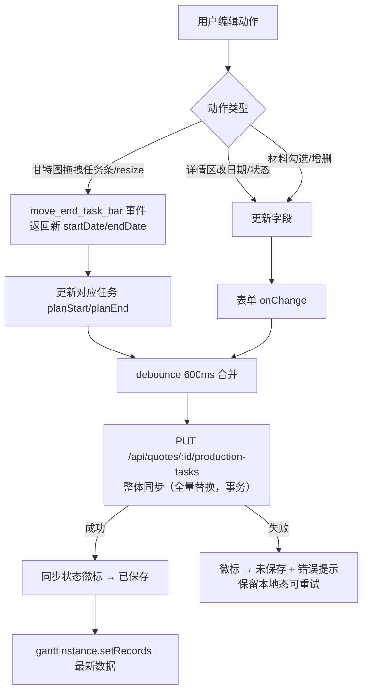

# 订单做货流程设计文档（V0.16 / Schema v24）

> 状态：**已确认（2026-09-06）** —— 决策结论见 §11，进入开发
> 涉及范围：订单编辑页/详情页（BagQuote.tsx）结构调整、新增"订单做货流程"标签页（甘特图）、数据库 V24 迁移、配套 API 与测试

---

## 1. 需求概述

| # | 需求 | 方案摘要 |
|---|------|---------|
| 1 | 页面结构优化 | BagQuote 页面引入标签页：Tab1「订单信息」（现有基础信息 + 在线表格，内容不变）；Tab2「订单做货流程」（新增） |
| 2 | 移除旧做货流程模块 | 删除 BagQuote.tsx 中 `status===3` 时渲染的三态按钮做货流程卡片（L1496-L1557） |
| 3 | 甘特图可视化 | 新增生产任务甘特图：每个生产阶段一个任务条，含计划起止（plan）与实际起止（actual）双轨 |
| 4 | 数据双向同步 | 甘特图编辑（改日期/拖拽/改状态/材料勾选）即时持久化到数据库；进入页面从数据库加载 |
| 5 | 材料准备管理 | 每个生产任务挂材料清单（名称/规格/数量/是否备齐），在 Tab2 内勾选管理 |

**现状要点**（勘察结论）：
- 订单数据全部存于 `quotes` 表（orders 表为旧模块，不涉及）
- 做货流程现為 6 个固定步骤（面料采购/裁剪/印刷/缝纫/质检/包装），三态存 `quotes.productionStepStatus` JSON（`{stepId: 'pending'|'in_progress'|'completed'}`），无任何时间信息
- BagQuote 已有 `readOnly` 模式（详情页 `/quotes/:id` 与编辑页 `/quotes/:id/edit` 复用同一组件），Tab2 在 readOnly 下只读展示
- 当前 Schema 版本：**v23**，本方案新增 **v24**

---

## 2. 页面布局设计（原型图）

### 2.1 页面整体结构

```
┌────────────────────────────────────────────────────────────────┐
│ ← 返回    订单号 Q20260906001    [查看模式/编辑模式]  [保存][打印]…│  ← 现有顶栏不变
├────────────────────────────────────────────────────────────────┤
│ ┌──────────────────┐ ┌──────────────────┐                       │
│ │ 订单信息 (Tab1)   │ │ 订单做货流程 (Tab2)│   ← 新增标签页切换栏   │
│ └──────────────────┘ └──────────────────┘                       │
├────────────────────────────────────────────────────────────────┤
│                      （当前选中 Tab 的内容区）                     │
└────────────────────────────────────────────────────────────────┘
```

### 2.2 Tab1「订单信息」（现有内容，移除做货流程卡片）

```
┌──────────────────────────────────────────────────────────────┐
│ 状态流转按钮区（报价中→打样中→…→已完成，不变）                    │
├──────────────────────────────────────────────────────────────┤
│ 收款信息区（不变）                                              │
├──────────────────────────────────────────────────────────────┤
│ ❌ 原做货流程卡片（status===3 时显示）—— 整体移除，功能并入 Tab2    │
├──────────────────────────────────────────────────────────────┤
│ 订单信息 + 在线表格（款式/模板、数量、规格、大货日期…，不变）        │
└──────────────────────────────────────────────────────────────┘
```

### 2.3 Tab2「订单做货流程」（新增）

```
┌──────────────────────────────────────────────────────────────────────┐
│ 订单做货流程                          [一键排期] [保存]  同步状态: 已保存│
├──────────────┬───────────────────────────────────────────────────────┤
│ 任务列表(左)   │  甘特图时间轴(右，按天，横向滚动)                       │
│              │  9/06  9/07  9/08  9/09  9/10  9/11  9/12  9/13  …    │
│ ① 面料采购 ●  │  ┌────┐←计划条(蓝)                                    │
│   进行中      │  │████│ ┌──────┐                                      │
│ ② 裁剪       │  └────┘ │ 计划  │← 任务的计划区间                       │
│   未开始      │         └──────┘                                      │
│              │  ▲绿色内芯 = 实际区间(进行中的任务延伸到今天▌)            │
│ ③ 手提       │  ┌───┐                                               │
│   未开始      │  │   │ …                                            │
│ ④ 印刷       │                                                      │
│ ⑤ 缝纫       │  ▍红色竖线 = 今天                                     │
│ ⑥ 包装       │                                                      │
│──────────────│───────────────────────────────────────────────────────│
│ [+ 添加步骤]  │  底部汇总条：计划 9/07~9/18 · 已完成 2/6 · 备料 4/8      │
├──────────────┴───────────────────────────────────────────────────────┤
│ 任务详情编辑区（点击行/任务条展开）：                                  │
│ 步骤名[面料采购] 状态[进行中▾] 计划[09/07~09/08] 实际[09/07~___] 备注[ ] │
│ 材料准备：                                                             │
│  ☑ 白色无纺布 100kg 供应商A    ☐ 印刷油墨 5桶    [+材料]                │
└──────────────────────────────────────────────────────────────────────┘
```

**readOnly（详情页）**：Tab2 甘特图正常展示，但拖拽/编辑/勾选全部禁用（`pointer-events-none` 模式，与现有做法一致）。

**Tab2 可见时机**：所有状态均可见（允许做货开始前排产）。状态 < 3（未进入做货中）时顶部显示一次性提示条："做货尚未开始，当前为预排期"。

---

## 3. 交互流程

### 3.1 Tab 切换与表格状态保持

```
用户点击 Tab 切换
  ├─ Tab1 → Tab2：在线表格区域 display:none（VTable 实例保留，不销毁）
  └─ Tab2 → Tab1：display 恢复（无重建、无公式重算，瞬时完成）
首次进入 Tab2
  └─ GET /api/quotes/:id/production-tasks
       ├─ 有数据 → 渲染甘特图
       └─ 空 → 自动生成 6 个默认步骤（内存态，标记"未保存"），
             第一步计划开始预填订单做货开始日期(productionTimeStart)，
             提示用户排期后保存
```

> 关键决策：**两个 Tab 始终挂载，用 CSS 隐藏切换**。原因：VTable 实例销毁重建成本高（模板初始化 + 全表公式重算约 200ms+，且丢失 undo 栈），甘特图为轻量 DOM 不受影响。

### 3.2 甘特图编辑与持久化（双向同步）



- **自动保存**：debounce 600ms 自动 PUT；顶部同步状态徽标（已保存/保存中/未保存）实时反馈；「保存」按钮兜底手动触发
- **乐观更新**：先改本地渲染，后台落库，失败回滚本地值并提示

### 3.3 状态联动规则

| 场景 | 行为 |
|------|------|
| 填写实际开始时间 | 任务状态自动 → `进行中` |
| 填写实际结束时间 | 任务状态自动 → `已完成` |
| 清空实际时间 | 状态回退为 `未开始`（不自动，弹确认） |
| 全部任务已完成 | Tab2 顶部提示"做货流程已全部完成，可流转至已发货"（仅提示，不自动流转） |
| 订单状态切到"做货中"(3) | 不再依赖旧 productionStepStatus；做货开始时间仍记 productionStartTime（不变） |

---

## 4. 数据结构设计

### 4.1 生产任务（前端类型 `ProductionTask`）

```typescript
export interface ProductionTask {
  id: string                  // 服务端生成（prod-task-{ts}-{rand}）
  stepOrder: number           // 步骤顺序（甘特图行序），1 开始
  name: string                // 步骤名称（默认 6 步，可改可增删，≤32 字符）
  planStart: string | null    // 计划开始 DATE 'YYYY-MM-DD'
  planEnd: string | null      // 计划结束 DATE
  actualStart: string | null  // 实际开始 DATE
  actualEnd: string | null    // 实际结束 DATE
  status: 0 | 1 | 2           // 0 未开始 / 1 进行中 / 2 已完成（与旧三态对齐）
  remark: string              // 备注 ≤255
  materials: ProductionMaterial[]  // 材料准备清单
}

export interface ProductionMaterial {
  name: string                // 材料名 ≤64
  spec: string                // 规格/型号 ≤64（如 90g白/10kg装）
  quantity: number            // 数量（两位小数）
  unit: string                // 单位（kg/桶/米…）≤8
  ready: boolean              // 是否已备齐
}
```

### 4.2 字段设计说明

| 决策点 | 结论 | 理由 |
|--------|------|------|
| 时间粒度 | DATE（天） | 做货排期以天为单位；DATETIME 对排期监督无增益且拖拽计算复杂 |
| 计划/实际双轨 | plan* + actual* 四字段 | "排期监督"核心 = 计划 vs 实际对比；甘特图双条渲染 |
| materials 用 JSON 列 | 是 | 材料清单仅在单订单内管理，规模小（每任务 <20 项），无跨订单统计需求；独立子表为过度设计，后续需要时再拆表（JSON 结构已预留） |
| 步骤可自定义 | 是（默认 6 步模板） | 不同工艺流程步骤有差异（如免印刷订单删印刷步骤）；沿用现有 6 步作为初始化模板，兼容旧数据 |
| 旧 productionStepStatus | 保留列，不再读写 | down 回滚需要；新代码全部走新表 |

---

## 5. 甘特图组件选型（已确认：VTable-Gantt）

**选定方案：`@visactor/vtable-gantt@1.26.6`**（已安装，与现有 `@visactor/vtable@1.26.6` 版本对齐，同属 VisActor 生态）。

| 对比项 | VTable-Gantt（选定 ✅） | 自研 CSS Grid | gantt-task-react | dhtmlx-gantt |
|--------|------------------------|---------------|------------------|--------------|
| 与现有技术栈一致性 | 同生态（VTable/VRender），主题风格统一 | 高 | 低（自带样式） | 低 |
| 任务条拖拽/resize | 内置 `taskBar.moveable/resizable` | 需自研 pointer 逻辑 | 内置 | 内置 |
| 计划/实际双轨 | 内置 `baseline*Field` 基线对比 | 需自研 | 无 | 内置 |
| 今天线/刻度 | 内置 `markLine` + `timelineHeader.scales` | 需自研 | 内置 | 内置 |
| 渲染性能 | Canvas（大数据量强） | DOM（小数据量够用） | DOM | Canvas |
| 许可证 | MIT | — | MIT | **GPL/商业** |

### 5.1 能力映射（需求 → VTable-Gantt 配置）

| 需求 | 配置/事件 |
|------|-----------|
| 时间轴日/周刻度 | `timelineHeader.scales: [{unit:'week'},{unit:'day'}]` |
| 左侧任务列表 | `taskListTable`（基于 ListTable：步骤名/状态/材料数列） |
| 计划条（可拖拽调整） | `taskBar.startDateField='planStart' / endDateField='planEnd'`，`moveable + resizable` |
| 实际条（只读对比） | `taskBar.baselineStartDateField='actualStart' / baselineEndDateField='actualEnd'`，`baselinePosition:'bottom'` |
| 进度内芯 | `progressField`（状态映射：0/50/100） |
| 今天线 | `markLine` |
| 拖拽结束持久化 | `GANTT_EVENT_TYPE.MOVE_END_TASK_BAR`（参数含新 startDate/endDate） |
| 点击任务条编辑 | `GANTT_EVENT_TYPE.CLICK_TASK_BAR` |
| 日期格式直配 | `dateFormat: 'yyyy-mm-dd'`（与 DATE 字段一致） |
| 时间范围 | `minDate/maxDate`（按任务时间范围 ± buffer 计算） |

### 5.2 拖拽语义（重要）

- **主条（可拖拽/resize）= 计划排期**：排期监督的核心操作是在图上直接调整计划
- **baseline 条（只读）= 实际执行**：实际时间是事实记录，通过详情表单录入，图上仅作对比展示
- 拖拽结束（`move_end_task_bar`）→ 更新对应任务 planStart/planEnd → 触发自动保存

---

## 6. 数据库设计变更（V24 迁移）

### 6.1 新表 DDL

```sql
CREATE TABLE IF NOT EXISTS quote_production_tasks (
  id            VARCHAR(64)  NOT NULL COMMENT '任务id（prod-task-{ts}-{rand}）',
  quote_id      VARCHAR(64)  NOT NULL COMMENT '所属订单（quotes.id）',
  step_order    INT          NOT NULL DEFAULT 1 COMMENT '步骤顺序（甘特图行序，小在前）',
  name          VARCHAR(64)  NOT NULL COMMENT '步骤名称',
  plan_start    DATE         NULL COMMENT '计划开始',
  plan_end      DATE         NULL COMMENT '计划结束',
  actual_start  DATE         NULL COMMENT '实际开始',
  actual_end    DATE         NULL COMMENT '实际结束',
  status        TINYINT      NOT NULL DEFAULT 0 COMMENT '0未开始 1进行中 2已完成',
  remark        VARCHAR(255) NOT NULL DEFAULT '' COMMENT '备注',
  materials     LONGTEXT     NULL COMMENT '材料清单 JSON：[{name,spec,quantity,unit,ready}]',
  created_at    DATETIME     NOT NULL DEFAULT CURRENT_TIMESTAMP,
  updated_at    DATETIME     NOT NULL DEFAULT CURRENT_TIMESTAMP ON UPDATE CURRENT_TIMESTAMP,
  PRIMARY KEY (id),
  KEY idx_qpt_quote_id (quote_id),
  KEY idx_qpt_plan_start (plan_start)
) ENGINE=InnoDB DEFAULT CHARSET=utf8mb4 COMMENT='订单做货流程任务（甘特图数据，V24）';
```

> 无唯一键冲突面（id 主键即唯一）；`idx_qpt_plan_start` 支撑未来跨订单按日期排期总览查询。

### 6.2 存量数据迁移（up 内，分批）

```sql
-- 对已有 productionStepStatus 非空的订单，按 6 个标准步骤生成任务行
-- 状态映射：pending→0, in_progress→1, completed→2；时间全部 NULL（旧数据无时间信息）
```
实现：Node 侧分批查询（每批 ≤1000 订单），逐单解析 JSON 插入 6 行任务；幂等（`INSERT ... SELECT WHERE NOT EXISTS` 或先查后插）。

### 6.3 down 回滚

1. 新表数据聚合回 `quotes.productionStepStatus`：`{stepId: status}`（取每单 status 最"靠后"的映射，即 1→in_progress / 2→completed 优先级 completed > in_progress > pending）
2. `DROP TABLE IF EXISTS quote_production_tasks`
3. `quotes.productionStepStatus` 列自 v9 起一直存在，无需恢复

### 6.4 配套变更（遵循数据库版本管理规则）

- `CURRENT_SCHEMA_VERSION` 23 → **24**
- 迁移对象：`version: 24, name: 'production-task-gantt'`，up/down 均幂等
- `db/schema/schema_v24.sql` 全量脚本同步（含新表 + schema_migrations 记录 v24）
- `tests/helpers/db-reset.ts`：`TABLES_TO_RESET` 加入 `quote_production_tasks`
- 权限种子：**不变**（见 §7.3）

---

## 7. API 设计

### 7.1 接口列表

| 方法 | 路径 | 说明 | 请求/响应要点 |
|------|------|------|--------------|
| GET | `/api/quotes/:id/production-tasks` | 获取任务列表 | 响应 `{ tasks: ProductionTask[] }`，按 step_order 升序；无数据返回 `[]`（前端初始化默认步骤） |
| PUT | `/api/quotes/:id/production-tasks` | 整体同步（全量替换） | 请求 `{ tasks: ProductionTask[] }`；事务内 `DELETE WHERE quote_id=?` + 批量 INSERT；响应 `{ tasks }`（服务端重排 id/时间戳后返回）；校验：quote 存在(404)、tasks ≤50 行、名称非空、日期格式、plan_start ≤ plan_end |

**整体替换而非逐行 CRUD 的理由**：每单任务量 6~15 行 × <1KB，全量负载极小；天然支持增删改混批、单事务强一致、实现最简；与项目现有 quotes 整体保存模式一致。

### 7.2 db.ts 新增 `productionTasks` 命名空间

```typescript
productionTasks: {
  getByQuoteId(quoteId): Promise<ProductionTaskRecord[]>
  replaceForQuote(quoteId, tasks): Promise<ProductionTaskRecord[]>  // 事务：删+插
}
```

### 7.3 权限

**复用现有权限，不新增权限项**：GET 挂 `quotes:view`、PUT 挂 `quotes:edit`。
理由：做货流程是订单数据的组成部分，能编辑订单者管理其排期符合业务直觉；权限目录已 43 项，避免膨胀。若未来需要"仅生产主管可改排期"的细粒度控制，再新增 `perm-production-tasks-edit`（接口签名不变，仅换中间件）。

---

## 8. 性能优化考虑

| 关注点 | 措施 |
|--------|------|
| Tab 切换卡顿 | 双 Tab 常驻 + CSS 隐藏；VTable 实例不销毁（避免模板重载 + 全表公式重算 + undo 栈丢失） |
| 拖拽流畅性 | VTable-Gantt 内置 Canvas 拖拽（无 DOM 重排）；拖拽结束才触发事件落库 |
| 甘特图重绘 | 保存成功后 `setRecords` 增量更新，不重建实例；records 量 ≤50 行无性能压力 |
| 保存请求风暴 | debounce 600ms 合并连续编辑；拖拽结束才触发；PUT 负载 <15KB |
| 数据库 | quote_id 普通索引；整体替换走单事务；存量迁移分批 ≤1000 行/批，总时长可控 <30s |
| 大 JSON 拒绝 | PUT 校验 tasks ≤50 行、materials 每任务 ≤50 项，防止 payload 失控 |

---

## 9. 测试计划

| 层 | 文件 | 覆盖 |
|----|------|------|
| 迁移 | `tests/migration-production-tasks.test.ts`（新增） | 表结构、存量数据迁移（JSON→任务行、状态映射）、幂等、down 回滚（聚合回 JSON）、版本号 24 |
| 后端 | 同上（集成） | getByQuoteId、replaceForQuote 事务原子性、校验规则（404/50 行上限/日期合法性）、权限（view/edit） |
| 前端逻辑 | `tests/productionTasks.test.ts`（新增） | 日期换算工具（DATE↔甘特 record）、状态联动规则（实际时间→状态）、一键排期算法、默认步骤初始化、payload 校验 |
| 组件 | `tests/production-tasks-tab.test.tsx`（新增，mock VTable-Gantt） | Tab 切换不销毁表格、默认步骤初始化、readOnly 禁用、材料勾选、自动保存触发/失败提示 |
| 回归 | `npm test` 全量 | 现有 1088 用例全部保持通过；rbac 权限数断言不变（43） |

覆盖率要求：新增前端源码文件（ProductionGantt 组件、productionTask 服务）纳入 `vitest.config.ts` coverage include，维持 ≥95% 行覆盖（与既有阈值 90% 相符并超出）。

---

## 10. 实施步骤（已确认，执行中）

1. **依赖安装**：`@visactor/vtable-gantt@1.26.6`（✅ 已完成，与 vtable 版本对齐）
2. **V24 迁移 + schema_v24.sql + db-reset**（规则 §1 全流程）
3. **后端**：db.ts productionTasks 命名空间 + quotes 路由挂 GET/PUT
4. **前端基础**：ProductionTask 类型、api 封装、Tab 切换结构（双 Tab 常驻）
5. **甘特图组件**：ProductionTasksTab.tsx（VTable-Gantt 封装：刻度/双轨任务条/今天线/拖拽事件）+ 任务详情编辑区 + 材料清单 + 自动保存
6. **移除旧模块**：删除 BagQuote.tsx L1496-L1557 做货流程卡片及 handleProductionStepChange 相关逻辑（productionStepStatus state 一并清理）
7. **测试**：按 §9 补齐，全量回归 + `tsc --noEmit`

---

## 11. 决策记录（已确认 2026-09-06）

| # | 决策点 | 结论 |
|---|--------|------|
| 1 | 甘特图实现 | **VTable-Gantt（@visactor/vtable-gantt@1.26.6）**，与现有 VTable 生态一致，内置拖拽/baseline 双轨/今天线 |
| 2 | 同步策略 | 整体替换 PUT + debounce 600ms 自动保存 |
| 3 | 材料存储 | tasks.materials JSON 列 |
| 4 | Tab2 可见时机 | 全状态可见（支持预排期，状态 <3 时顶部提示"当前为预排期"） |
| 5 | 权限 | 复用 quotes:view/edit，不新增权限项 |
| 6 | 一键排期 | 提供（按做货起止日期自动均分各步骤） |
| 7 | 拖拽语义 | 主条=计划（可拖拽调整）；baseline=实际（只读对比，表单录入） |
